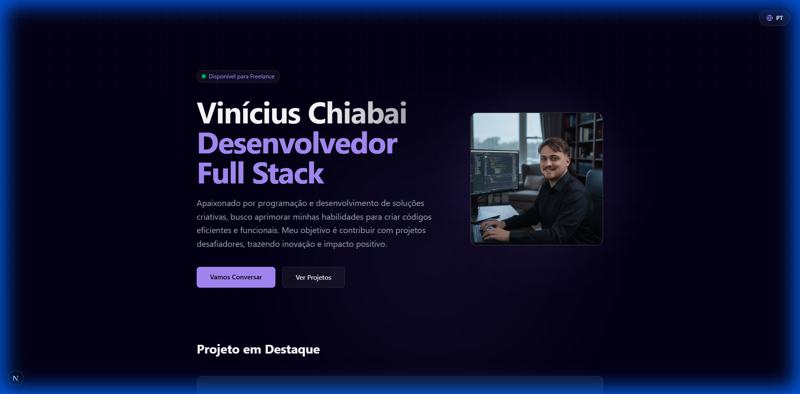

# Vinícius Chiabai | Full Stack Developer Portfolio



A modern, high-performance portfolio website built with **Next.js 14**, **TypeScript**, and **Tailwind CSS**. This project showcases my skills, experience, and projects with a premium dark mode aesthetic, smooth animations, and full internationalization support.

## 🚀 Features

-   **🌍 Internationalization (i18n)**: Full support for Portuguese (PT-BR) and English (EN) with persistent language selection.
-   **⚡ Modern Tech Stack**: Built with the latest Next.js App Router and React Server Components.
-   **🎨 Premium UI/UX**: Custom dark theme with glassmorphism, glow effects, and smooth transitions using Framer Motion.
-   **📱 Fully Responsive**: Optimized for all devices, from mobile phones to large desktop screens.
-   **🎥 Interactive Project Cards**: Hover-to-play video previews for featured projects.
-   **📧 Direct Contact**: Integrated WhatsApp and Email buttons for quick communication.

## 🛠️ Tech Stack

-   **Framework**: [Next.js 14](https://nextjs.org/)
-   **Language**: [TypeScript](https://www.typescriptlang.org/)
-   **Styling**: [Tailwind CSS](https://tailwindcss.com/)
-   **Icons**: [Lucide React](https://lucide.dev/)
-   **Animations**: [Framer Motion](https://www.framer.com/motion/)
-   **Deployment**: [Vercel](https://vercel.com/)

## 🏃‍♂️ Getting Started

1.  **Clone the repository**
    ```bash
    git clone https://github.com/vini826/portfolio.git
    cd portfolio
    ```

2.  **Install dependencies**
    ```bash
    npm install
    ```

3.  **Run the development server**
    ```bash
    npm run dev
    ```

4.  Open [http://localhost:3000](http://localhost:3000) with your browser to see the result.

## 📂 Project Structure

```bash
src/
├── app/              # App Router pages and layouts
├── components/       # Reusable UI components
├── context/          # React Context (Language state)
├── lib/              # Utilities and Translations
└── public/           # Static assets (images, videos)
```

## 📬 Contact

-   **LinkedIn**: [Vinícius Chiabai](https://www.linkedin.com/in/vinícius-chiabai)
-   **GitHub**: [@vini826](https://github.com/vini826)
-   **Email**: [vinicius.chiabai@gmail.com](mailto:vinicius.chiabai@gmail.com)

---

Developed with 💜 by **Vinícius Chiabai**.
